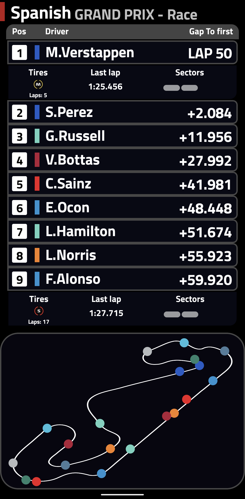

## F1 Racing companion

### Features

An android app written in Kotlin allowing to track live timing data from F1 sessions.
The app uses livetiming signalr api to display data such as:

* positions
* last lap times
* gaps to next/leader
* current tires and their age
* indicators of every sector
* current position of every driver on the track

When no session is running, the app displays countdown to the next session.

### Screens
  

## Supported tracks for live position of the drivers

Currently, there are provided tracks for the following events (circuit pngs are made from [f1laps/f1-track-vectors](https://github.com/f1laps/f1-track-vectors) on MIT [license](https://github.com/f1laps/f1-track-vectors/blob/main/LICENSE)):

* Bahrain Grand Prix
* Emilia Romagna Grand Prix
* Spanish Grand Prix
* Monaco Grand Prix
* Azerbaijan Grand Prix
* French Grand Prix
* Austrian Grand Prix
* British Grand Prix
* Hungarian Grand Prix
* Belgian Grand Prix
* Dutch Grand Prix
* Italian Grand Prix
* United States Grand Prix
* Mexico City Grand Prix
* São Paulo Grand Prix
* Abu Dhabi Grand Prix
* Singapore Grand Prix
* Japanese Grand Prix
* Canadian Grand Prix

### Install

To install the app, download the latest bundle or apk release from repo or just clone repository and build it yourself.

### Data sources

F1RacingCompanion uses data from a [F1 livetiming signalr](https://livetiming.formula1.com/) api
(the same which is used in the official mobile app).   
Huge thanks to [FastF1](https://github.com/theOehrly/Fast-F1/) GitHub repo for understanding the api and data provided by it (if you are interested in data analysis of formula 1 you should check it).
Also to provide countdown to next events [ErgastAPI](http://ergast.com/mrd/) is used.

### TO DO:

* implement car telemetry - data layer (dtos, repository) is done.
* change protocol from websocket to SSE - need to find a way to test them.
* add missing tracks and their information
* improve UI design - currently it only supports dark mode and home
  screen has to be improved
* add speeds, best lap times data to the app - data layer is also done
  only UI and viewModels are left.

### Notice

F1RacingCompanion is unofficial software and in no way associated with the Formula 1 group of companies.
